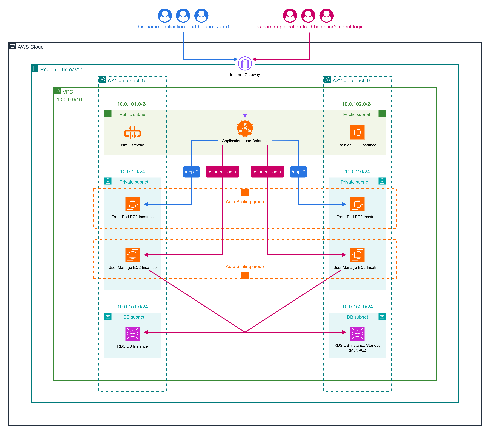

# 🚀 Multi-Tier AWS Infrastructure Using Terraform

> A modular Terraform-based AWS setup that provisions a complete production-grade multi-tier architecture using official Terraform Registry modules.

## 🏗️ Architecture Diagram

  

## 📌 Project Overview

This project builds a full production-style AWS environment using Terraform modules. It includes secure networking, application servers across private subnets, a Bastion host for administrative access, and an RDS MariaDB backend with automated table creation. Automated provisioning is handled through **null resource provisioners**, which transfer SSH keys, copy SQL initialization scripts to the Bastion host, and execute them to create required tables inside the RDS instance.

## 📦 Terraform Provisioning Scope

Terraform provisions the following components in this project:

### 🛡️ Network Layer
- Custom VPC  
- 2 public subnets  
- 2 private backend subnets  
- 2 private database subnets  
- Internet Gateway  
- NAT Gateway + Elastic IP  
- Route tables + associations  
- Multiple security groups:
  - Bastion Host SG  
  - Load Balancer SG  
  - Private EC2 SG  
  - RDS SG 

### ⚙️ Compute & Application Layer
- Bastion Host (with Elastic IP)  
- Application Load Balancer  
- Target Group + Listener  
- Autoscaling Groups  
- Private EC2 Instances:
  - `/app1` — Instance Health/Metadata HTML app  
  - `/student-login` — Java-based student registration app (connected to RDS)  

### 🗄️ Database Layer
- RDS MariaDB (multi-AZ optional)  
- Private DB subnets  
- Automated SQL table creation through Bastion-host execution  

### 🔧 Automation & Provisioners
- Null resource provisioners:
  - Transfers the SSH private key to the Bastion host, allowing secure SSH access into private EC2 instances  
  - Copy SQL script for table creation  
  - Execute SQL commands to initialize the DB schema 
